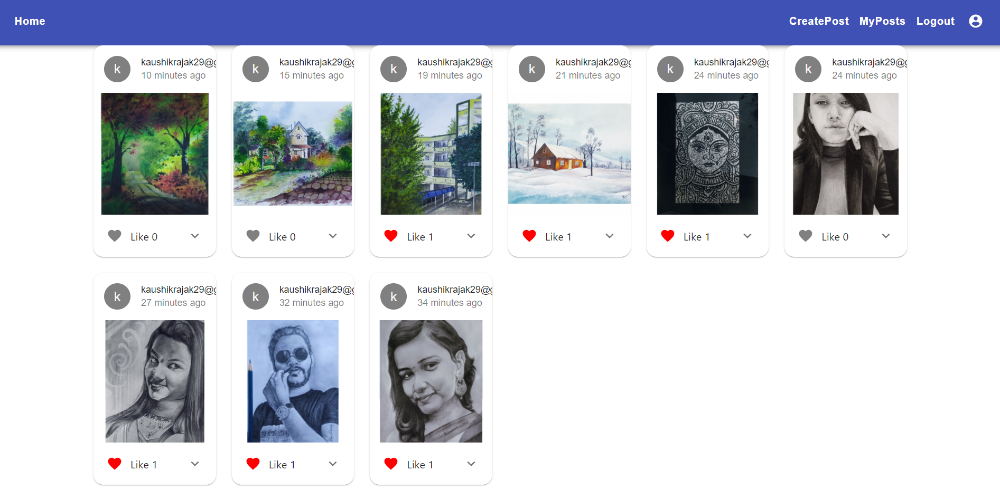
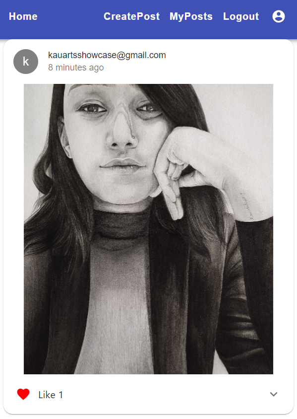
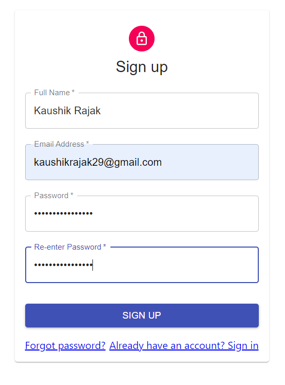

# Art Showcase
This is a MERN based web aplication where anyone can showcase their artworks and get appreciation from other creators.

## Installation
Need to install [nodejs](https://nodejs.org/en/download/) for building and running this project.
After the installation of [nodejs](https://nodejs.org/en/download/) follow the following steps:

1.Need to create a [mongodb](https://www.mongodb.com/) cluster and set the claster URL to CONNECTION_URL in .evn file.      

2.This project is using one email address for sending email to users.So need to set the credetials in .evn file.

3.Make sure to set all the variables correctly in .evn file .

4.Build and run the server in one terminal
```bash
cd server
npm install
npm start
```
5.Build and run client in another terminal
```bash
cd client
npm install
npm start
```
You are ready to explore the features of the project :)

## Features in the project
1.SignIn

2.SignUp

3.Reset Password using Email

4.Add post

5.Edit and delete your post

6.Explore recent posts

7.Like post

# Some snapshots of the application




You can see all snapshots in images folder.
